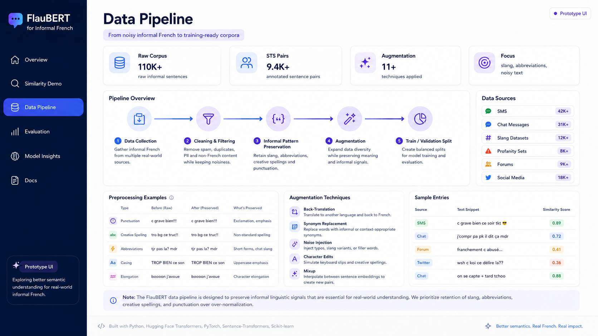
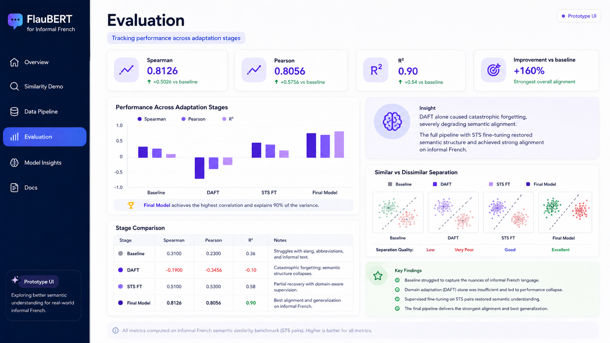
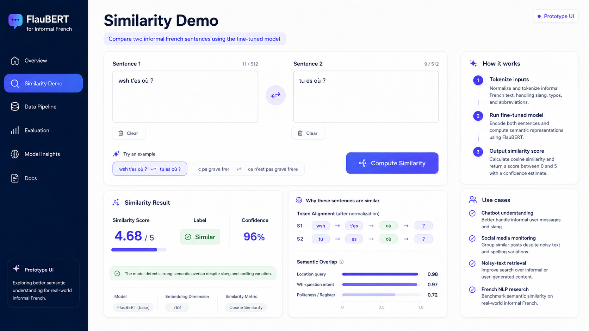

# Fine-Tuning FlauBERT for Informal French

An NLP research project exploring semantic textual similarity for informal French, including slang, abbreviations, and conversational phrasing.

## Research question

Can a French language model better capture the semantic similarity of informal French after task-specific fine-tuning?

## Reported result

On the evaluation setup documented in this repository, Spearman correlation increased from **0.32** for the baseline to **0.81** after fine-tuning. This is a correlation result—not a classification accuracy score—and should be interpreted within the dataset and split used by the notebooks.

## Repository contents

```text
├── app.py                  # Streamlit inference interface
├── notebooks/              # Preprocessing, training, evaluation, visualisation
├── data/                   # Research datasets
├── assets/                 # Project figures and screenshots
└── Report/
    └── Final_year_project_report.pdf
```

## Method

1. Assemble and clean informal French sentence pairs.
2. Fine-tune FlauBERT for semantic similarity regression.
3. Compare predicted scores with reference similarity scores.
4. Evaluate using Spearman correlation.
5. Explore results through notebooks and a Streamlit interface.

## Run the interface

The application requires a compatible fine-tuned sequence-classification checkpoint. Set its Hugging Face model name or local path before starting:

```bash
git clone https://github.com/BryanFinnon/Fine-Tuning-FlauBERT-for-Informal-French.git
cd Fine-Tuning-FlauBERT-for-Informal-French
python -m venv .venv
source .venv/bin/activate
pip install -r requirements.txt
export MODEL_NAME=/path/to/fine-tuned-checkpoint
streamlit run app.py
```

The base `flaubert/flaubert_base_cased` checkpoint is not used as an automatic fallback because a newly created regression head would produce untrained scores.

## Visual overview







## Limitations

- Results depend on the supplied datasets and evaluation split.
- Informal language varies across regions, communities, and time.
- The repository does not publish a hosted fine-tuned checkpoint.
- Reproduction may vary with library versions and random seeds.

## Author

Bryan Finnon — MSc Computer Science (Distinction), focused on applied AI and software engineering.
