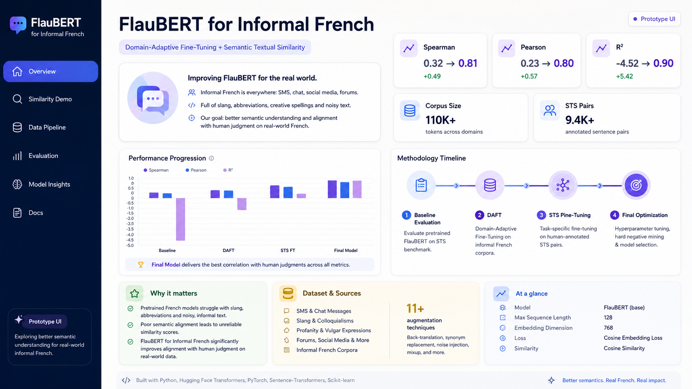

# 🤖 Enhancing FlauBERT for Informal French (DAFT + STS)

> Final Year Project — Improving embeddings for informal French using Domain-Adaptive Fine-Tuning and Semantic Textual Similarity.

---

## 📖 Overview

Pretrained French NLP models are mostly trained on **formal data**, limiting their ability to understand **informal language** (slang, abbreviations, noisy text).

This project improves **FlauBERT** by adapting it to informal French through:
- Domain-Adaptive Fine-Tuning (DAFT)
- Task-specific fine-tuning on **Semantic Textual Similarity (STS)**

The objective is to enhance **semantic embeddings** and improve similarity understanding in real-world informal text.

📄 Based on final year research project :contentReference[oaicite:0]{index=0}

---

## 🚀 Key Results

- Spearman correlation: **0.32 → 0.81**
- Pearson correlation: **0.23 → 0.80**
- R² score: **-4.52 → 0.90**
- Significant improvement in embedding quality and semantic alignment

Results validated across multiple evaluation stages :contentReference[oaicite:1]{index=1}

---

## 🧠 Methodology

### 1. Baseline Evaluation
- Evaluated original FlauBERT on informal STS task
- Identified strong performance gap on informal data

### 2. Domain-Adaptive Fine-Tuning (DAFT)
- Continued pretraining using masked language modeling (MLM)
- Adapted model to informal linguistic patterns

⚠️ Observation: DAFT alone caused **catastrophic forgetting** (loss of semantic structure)

### 3. STS Fine-Tuning (Supervised)
- Fine-tuned regression head on sentence similarity task
- Used annotated sentence pairs with similarity scores (0–5)

### 4. Final Optimization
- Switched to `AutoModelForSequenceClassification`
- Leveraged trained regression head for final predictions

---

## 📊 Dataset

### Main Dataset
- Built from multiple sources (SMS, slang, profanity datasets)
- Focus on **informal French (slang, abbreviations, noisy text)**
- Final size: **100,000+ samples after augmentation**

### STS Dataset
- **9,400+ sentence pairs**
- Annotated using semantic similarity scores (0–5)
- Bootstrapped annotation for scalability

Data pipeline includes:
- augmentation (11+ techniques)
- cleaning and filtering
- preservation of informal patterns (punctuation, casing)


---

## ⚙️ Tech Stack

- Python  
- Hugging Face Transformers  
- PyTorch  
- Sentence-Transformers  
- Scikit-learn  
- Pandas / NumPy  

---


## 📈 Evaluation

| Stage        | Spearman | Pearson |
|-------------|----------|---------|
| Baseline    | 0.3200   | 0.2378  |
| DAFT        | -0.2798  | -0.2361 |
| STS FT      | -0.2069  | -0.1313 |
| Final Model | 0.8126   | 0.8056  |

✔ Final model significantly outperforms baseline  
✔ Strong separation between similar and dissimilar pairs  


---


## 📂 Project Structure

```bash
.
├──app.py             #Demo
├── notebooks/        # Jupyter notebooks (core pipeline)
│   ├── preprocessing.ipynb
│   ├── main_work.ipynb
│   ├── eval.ipynb
│   ├── visualisation.ipynb
│
├── data/             # Datasets (raw, processed, STS)
│   ├── corpus_maitre.csv
│   ├── final_corpus.csv
│   ├── STS_dataset.csv
│   ├── sts_finetuning_dataset.csv
│
├── report/           # Academic report
│   └── Final_year_project_report.pdf
│
└── README.md


--- 


# 🖥️ Demo

A simple interactive prototype is available using Streamlit.

# Run locally:

pip install streamlit transformers torch
streamlit run app.py


## 🚀 Aperçu du Projet (Screenshots)

### 🖥️ Vue Principale (Hero Shot)
Voici l'interface utilisateur principale avec des données simulées en temps réel :


### 💡 Fonctionnalités Clés
<table>
  <tr>
    <th width="50%">Le Mode Sombre intégré</th>
    <th width="50%">L'analyseur de données</th>
  </tr>
  <tr>
    <td></td>
    <td></td>
  </tr>
</table>
```

## 🚀 Project Overview (Screenshots)

### 🖥️ Main Dashboard (Hero Shot)
The central project dashboard tracks the overall performance progression, methodology timeline, and dataset scale ($110\text{K}+$ tokens across informal domains):


### 💡 Core Features & Technical Workflow

<table>
  <tr>
    <th width="50%">🔄 Interactive Semantic Similarity Demo</th>
    <th width="50%">⚙️ Robust Data Processing Pipeline</th>
  </tr>
  <tr>
    <td>
      <p>Compare two informal French sentences side-by-side. The model computes a precise similarity score, analyzes token alignment, and quantifies semantic overlap despite heavy slang or typos.</p>
      
    </td>
    <td>
      <p>Tracks how raw informal text corpus moves from ingestion through advanced cleaning, informal pattern preservation, and data augmentation techniques to become training-ready data.</p>
      
    </td>
  </tr>
</table>

### 📊 Deep-Dive Model Evaluation
A comprehensive breakdown tracking key evaluation metrics across multiple adaptation stages (Baseline, DAFT, STS FT, and the Final Model). It explicitly surfaces Spearman, Pearson, and $R^2$ scores alongside mathematical cluster separations:

